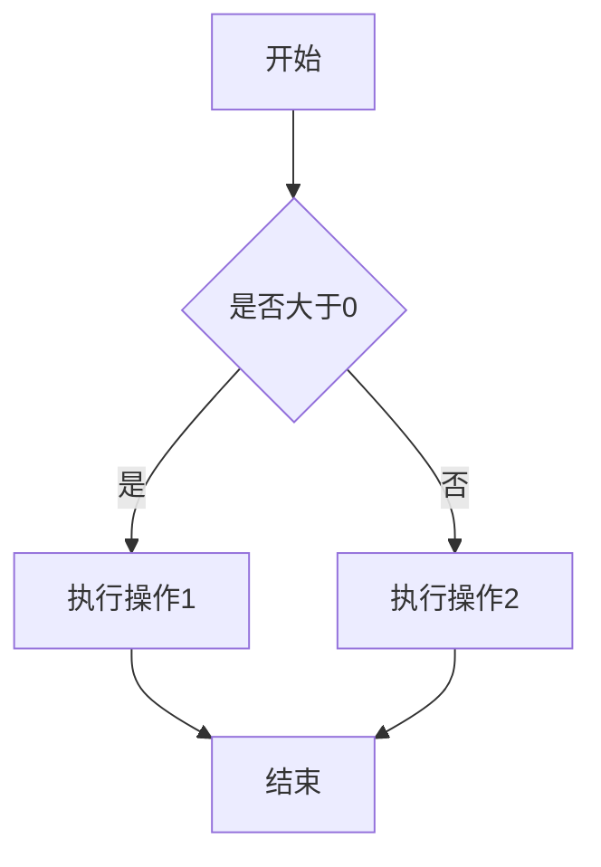
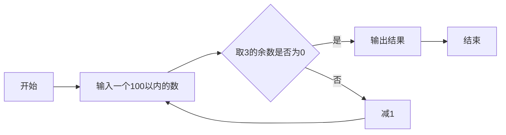
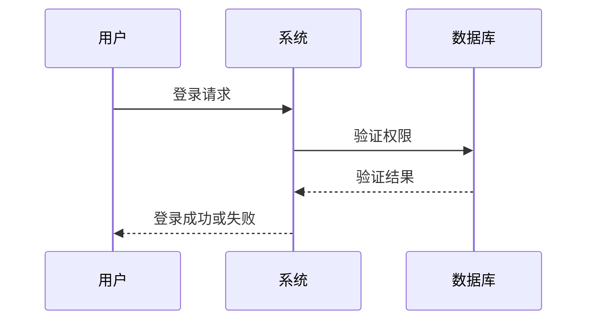
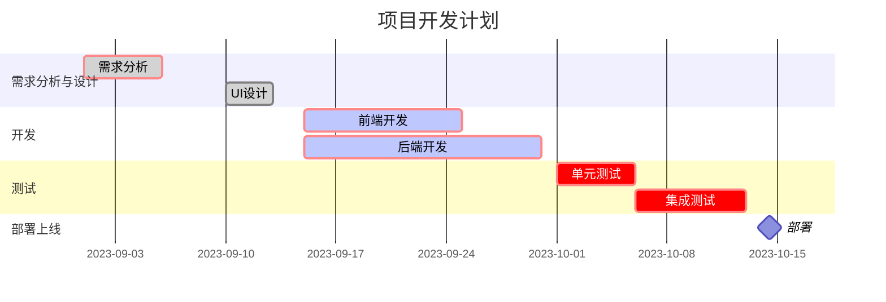
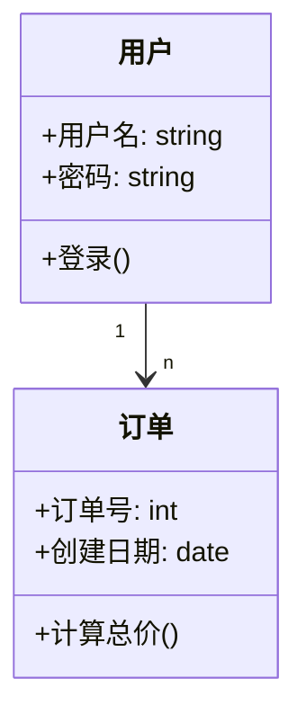
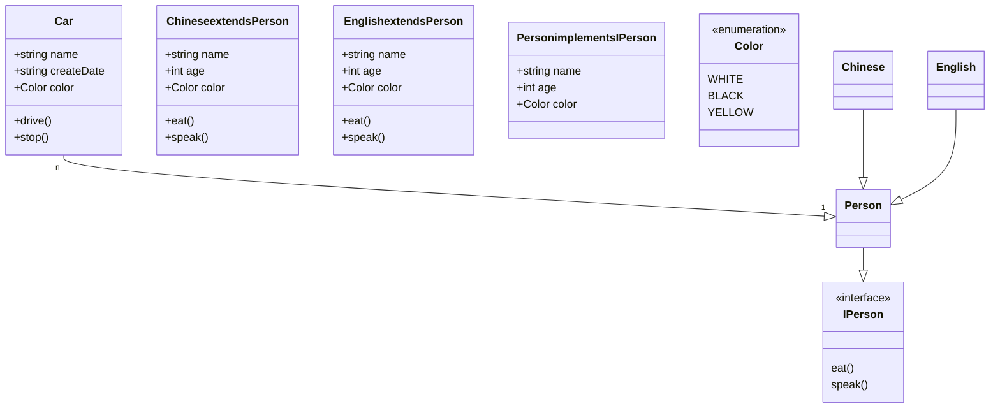
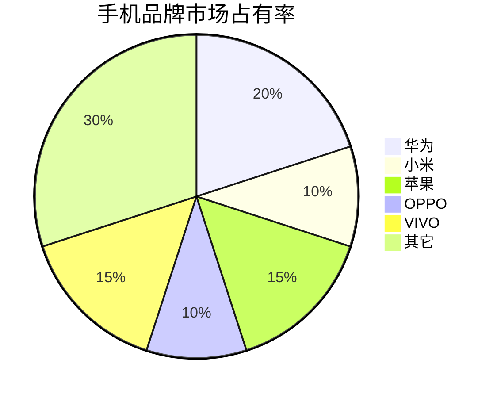

# markdown 教程

## 目录

- [1 概述](#1-概述)

- [2 基础语法](#2-基础语法)

  - [2.1 标题](#21-标题)

  - [2.2 文本格式](#22-文本格式)

    - [2.2.1 段落](#221-段落)

    - [2.2.2 字体](#222-字体)

    - [2.2.3 分隔线](#223-分隔线)

    - [2.2.4 删除线](#224-删除线)

    - [2.2.5 下划线](#225-下划线)

    - [2.2.6 脚注](#226-脚注)

    - [2.2.7 代码标记](#227-代码标记)  

    - [2.2.8 文本高亮](#228-文本高亮)

  - [2.3 列表](#23-列表)

    - [2.3.1 无序列表](#231-无序列表)

    - [2.3.2 有序列表](#232-有序列表)

    - [2.3.3 列表嵌套](#233-列表嵌套)

    - [2.3.4 任务列表](#234-任务列表)

  - [2.4 引用块](#24-引用块)

  - [2.5 链接](#25-链接)

    - [2.5.1 行内链接](#251-行内链接)

    - [2.5.2 参考链接](#252-参考链接)

    - [2.5.3 自动链接](#253-自动链接)

    - [2.5.4 锚点链接](#254-锚点链接)

  - [2.6 图片](#26-图片)

## 1 概述

markdwon 是一种轻量级标记语言  
Markdown 编写的文档后缀为 `.md`, `.markdown`  
Markdown 编写的文档可以导出 HTML 、Word、图像、PDF、Epub 等多种格式的文档

**Markdown 与 HTML 的关系**：  
传统的标记语言如 HTML 功能强大但语法复杂，而轻量级标记语言则简化了这一过程。
在 Markdown 中你可以直接使用 HTML 标签，这为复杂格式提供了灵活性。当 Markdown 的基础语法无法满足需求时，可以嵌入 HTML 代码来实现特定效果

## 2 基础语法

### 2.1 标题

**2.1.1** 使用 `=` 和 `-` 标记一级和二级标题

```markdown

一级标题
============

二级标题
------------

```

**2.1.2** 使用 `#` 号标记 1-6 级标题

Markdown 使用 # 号来创建标题，这是从 HTML 的 `<h1>` 到 `<h6>` 标签概念演化而来的

**注意：**

- `#` 号和标题文字之间必须有一个空格

- 行首位置：`#` 号必须在行首，前面不能有其他字符（空格或制表符）

- 在一个文档中，通常只使用一个一级标题作为文档的主标题

```markdown

# 一级标题

## 二级标题

### 三级标题

#### 四级标题

##### 五级标题

###### 六级标题

```

**2.1.3** 标题锚点

```markdown
    # 标题锚点示例

    ## 目录

    [# 第一章]{#1第一章}

    [## 第一节] {#1.1-第一节}

    ## 1.第一章    <!-- 序号和标题使用.连接，目录中标题锚点无处理 -->

    ### 1.1 第一节 <!-- 序号和标题使用空格连接，目录中标题锚点改为短横线-连接 -->

```

### 2.2 文本格式

#### 2.2.1 段落

段落的换行是使用两个以上空格加上回车

```markdown

段落1   
段落2

```

段落后面使用一个空行来表示重新开始一个段落

```markdown

段落1

段落2

```

html br标签可以强制换行

```markdown

段落1<br>段落2

```

#### 2.2.2 字体

**斜体语法** ：在需要倾斜的文字前后各加`*`或`_`
**粗体语法** ：在需要加粗的文字前后各加`**`或`__`
**粗斜体语法** ：在需要加粗倾斜的文字前后各加`***`或`___`

**注意：**:推荐使用星号 `*` 而不是下划线 `_`，因为星号在各种 Markdown 解析器中兼容性更好

```markdown

*斜体*

**粗体**

***粗斜体***
```

#### 2.2.3 分隔线

一行中用三个以上的星号、减号、底线来建立一个分隔线，行内不能有其他东西。也可以在星号或是减号中间插入空格

```markdown
分隔线1
---

分隔线2
- - - -

分隔线3
***

分隔线4
* * *
```

#### 2.2.4 删除线

在需要删除的文字前后各加两个波浪线 `~~`

```markdown

~~删除线~~

```

#### 2.2.5 下划线

下划线可以通过 HTML 的 `<u>` 标签来实现

```markdown

<u>下划线</u>

```

#### 2.2.6 脚注

脚注是对文本的补充说明。在需要添加脚注的文字后，使用 `[^1]` 或 `[^脚注1]` 的形式，然后在文档的末尾使用 `[^1]:` 或 `[^脚注1]：` 来添加脚注内容

```markdown

程序员一般都会使用 github[^1] ,自从AI编程兴起，使用 CURSOR[^CURSOR] 的程序员越来越多了。

[^1]: github 是一个在线的版本仓库托管服务
[^CURSOR]: CURSOR 是一个AI编程助手

```

#### 2.2.7 代码标记

行内代码标记

```markdown

使用 `git clone` 命令来克隆一个仓库  <!-- 行内代码标记使用反引号 ` 包裹 -->

特殊字符转义

显示代码中的反引号 `` `git clone` ``  <!-- 显示代码中的反引号 `git clone` -->

```

多行代码标记

**单行代码块**：在代码块的前后各用一个反引号 ` 包裹

**多行代码块**：在代码块的前后各用一个三个反引号 ` 包裹

```markdown

单行代码块

`git clone`
```

多行代码块

三反引号（```）是最常用的代码块语法，支持语法高亮和多行代码展

其他特殊字符处理：

HTML 标签：`<div>` 元素
数学符号：计算 x + y = z
特殊符号：使用 `&nbsp;` 表示空格

`` ```git add .  git commit -m 'message' ``` ``

<!-- 
 ```
 git add .  
 git commit -m 'message' 
 
 ``` 
-->

#### 2.2.8 文本高亮

文本高亮不是标准 Markdown 语法，但许多扩展支持

```markdown

文本高亮

==高亮文本==

html 实现高亮文本

<mark>高亮文本</mark>

```

### 2.3 列表

#### 2.3.1 无序列表

无序列表使用星号 `*`、加号 `+` 或减号 `-` 作为标记，标记后面需要添加一个空格

建议统一使用减号 -，因为它在视觉上更清晰

```markdown

- 列表项1
- 列表项2
- 列表项3

```

#### 2.3.2 有序列表

有序列表使用数字和点 `.` 作为标记，标记后面需要添加一个空格  
数字可以不连续,Markdown 会自动修正数字顺序

```markdown

1. 列表项1
2. 列表项2
3. 列表项3

Markdown 会自动修正数字顺序
3. 列表项1
5. 列表项2
8. 列表项3
```

#### 2.3.3 列表嵌套

嵌套规则：

子列表需要缩进 2-4 个空格（推荐 2 个）
保持一致的缩进长度
可以无限层嵌套，但实际使用中建议不超过 3 层

```markdown
无序列表嵌套

- 列表项1
    - 列表项1.1
    - 列表项1.2
- 列表项2
    - 列表项2.1
    - 列表项2.2

有序列表嵌套

1. 列表项1
    1. 列表项1.1
    2. 列表项1.2
2. 列表项2
    1. 列表项2.1
    2. 列表项2.2

```

#### 2.3.4 任务列表

任务列表是 GitHub 风格 Markdown 的扩展功能，现在被广泛支持
任务列表使用 `- [ ]` 或 `- [x]` 来标记未完成或已完成的任务

```markdown

- [ ] 未完成任务
- [x] 已完成任务
- [ ] 另一个未完成的任务

```

### 2.4 引用块

Markdown 区块引用是在段落开头使用 > 符号 ，然后后面紧跟一个空格符号

```markdown
单级引用的使用

> 这是一个引用块
> 可以在引用块中嵌套其他 Markdown 语法

多行引用的使用

> 这是一个引用块
> 可以在引用块中嵌套其他 Markdown 语法
> 这是一个引用块

多行简化引用的使用

> 这是一个引用块
包含多行内容，
只需要在第一行使用 > 符号。

```

多级嵌套引用

```markdown

> 一级引用
> > 二级引用
> > > 三级引用

```

重要信息提示

``` markdown

成功提示：

> &#x2705; **成功**
> 
> 配置已保存并生效。系统将在下次重启时应用新设置。

警告信息：

> &#x26a0;&#xfe0f; **警告**
> 
> 此操作不可逆转，请确保已备份重要数据。

错误信息：

> &#x274c; **错误**
> 
> 连接数据库失败，请检查网络连接或联系系统管理员。

信息提示：

> &#x2139;&#xfe0f; **提示**
> 
> 首次使用需要进行账户验证，验证邮件已发送到您的邮箱。
```

### 2.5 链接

#### 2.5.1 行内链接

在链接文字的两侧各用一个方括号 `[]` 包裹，然后在链接文字的右侧使用圆括号 `()` 包裹链接地址

```markdown
[链接名称](链接地址)
[链接文字](链接地址 "可选的标题")

[百度](https://www.baidu.com)
[百度](https://www.baidu.com "百度一下，你就知道")
```

#### 2.5.2 参考链接

在链接文字的两侧各用一个方括号 `[]` 包裹，然后在文档末尾使用两个方括号 `[]` 包裹链接地址

```markdown
语法：
[链接名称][参考名称] <!-- 正文中的参考链接-->

[参考名称]: 链接地址 <!-- 文末参考链接-->

示例：
[百度][1]
[百度][百度]
[baidu][]<!--链接名称与参考名称相同可使用[]简写参考名称-->

<!-- 文末参考链接-->
[1]: https://www.baidu.com
[百度]: https://www.baidu.com
[baidu]: https://www.baidu.com

```

#### 2.5.3 自动链接

在 Markdown 中，你可以使用尖括号 `<>` 来包裹 URL，这样 Markdown 会自动将其转换为链接

**注意事项**：

- 自动识别功能依赖于具体的 Markdown 解析器
- 为了确保兼容性，建议使用标准的链接语法
- 某些特殊字符可能影响自动识别

```markdown
<https://www.baidu.com>

```

#### 2.5.4 锚点链接

锚点规则：

- 标题会自动生成锚点
- 锚点名称通常是标题的小写形式
- 空格替换为连字符
- 移除特殊字符

```markdown

# 标题锚点示例

## 目录

[# 第一章]{#1第一章}

[## 第一节] {#1.1-第一节}

## 1.第一章    <!-- 序号和标题使用.连接，目录中标题锚点无处理 -->

### 1.1 第一节 <!-- 序号和标题使用空格连接，目录中标题锚点改为短横线-连接 -->

```

html 实现锚点链接

```markdown
<a id="custom-anchor">自定义锚点位置</a>
......
......

[自定义锚点](#custom-anchor)
```

回到顶部

```markdown

[回到顶部](#顶部标题名称)  <!-- 使用#表示回到顶部 -->
```

[回到顶部](#markdown-教程)

### 2.6 图片

**语法**：

- 开头一个感叹号 `!`
- 接着一个方括号，里面放上图片的替代文字
- 接着一个普通括号，里面放上图片的网址，最后还可以用引号包住并加上选择性的 'title' 属性的文字

**建议**：

- 推荐使用相对路径，便于项目移植
- 建议创建专门的图片文件夹（如 images/、assets/）
- 使用有意义的文件名，便于管理
- 注意路径分隔符在不同操作系统中的差异

#### 2.6.1 相对路径

``` markdown


```


#### 2.6.2 绝对路径

```markdown

```


#### 2.6.3 网络图片

```markdown

```


#### 2.6.4 图片链接组合

``` markdown
[](https://www.runoob.com)
```

[](https://www.runoob.com)

#### 2.6.5 设置图片大小

Markdown 还没有办法指定图片的高度与宽度，你可以使用普通的 `` 标签

```markdown


```

#### 2.6.6 图片居中和对齐

方法一：HTML + CSS

``` markdown
<div style="text-align:center">
    
</div>
```

方法二：HTML对齐属性

``` markdown
<div align="center">
    
</div>
```

方法三：创建图片画廊

``` markdown
<div style="display: flex; flex-wrap: wrap; justify-content: center;">
    
    
    
</div>
```

### 2.7 表格

Markdown 制作表格使用 | 来分隔不同的单元格，使用 - 来分隔表头和其他行

**语法**:

``` markdown
|  表头   | 表头  |
|  ----  | ----  |
| 单元格  | 单元格 |
| 单元格  | 单元格 |
```

**语法要点**：

- 表头和数据行之间必须有分隔线
- 分隔线至少需要三个连字符 `---`
- 两端的竖线 `|` 是可选的，但建议保留以提高可读性
- 不需要严格对齐，但对齐后更美观

**对齐方式**:

``` markdown
----: 设置内容和标题栏居右对齐。
:--- 设置内容和标题栏居左对齐。
:---: 设置内容和标题栏居中对齐。

| 左对齐 | 居中对齐 | 右对齐 |
| :----- | :------: | -----: |
| 单元格 | 单元格   | 单元格 |
| 单元格 | 单元格   | 单元格 |
```

**表格单元格内可以使用大部分 Markdown 语法**:

``` markdown
| 表头   | 表头  |
|  ----  | ----  |
| 单元格  | [链接](https://www.runoob.com) |
| 单元格  |  |
| 单元格  | <https://www.runoob.com> |
```

表格中特殊符号转义

``` markdown

| 字符 | 转义方法 | 示例 |
|------|----------|------|
| 竖线 | `\|` | 显示 \| 符号 |
| 反斜杠 | `\\` | 显示 \\ 符号 |
| HTML | 直接使用 | <code>&lt;div&gt;</code> |

```

示例效果

| 字符 | 转义方法 | 示例 |
|------|----------|------|
| 竖线 | `\|` | 显示 \| 符号 |
| 反斜杠 | `\\` | 显示 \\ 符号 |
| HTML | 直接使用 | `<div>` |

### 2.8 高级语法

#### 2.8.1 支持的 HTML 元素

不在 Markdown 涵盖范围之内的标签，都可以直接在文档里面用 HTML 撰写。

目前支持的 HTML 元素有：``<kbd> <b> <i> <em> <sup> <sub> <br>``等

``` markdown
<kbd>Ctrl</kbd> + <kbd>Alt</kbd> + <kbd>Del</kbd>  重启电脑
```

<kbd>Ctrl</kbd> + <kbd>Alt</kbd> + <kbd>Del</kbd>  重启电脑

#### 2.8.2 转义字符

Markdown 支持以下这些符号前面加上反斜杠来帮助插入普通的符号：

``` markdown
\   反斜线
`   反引号
*   星号
_   下划线
{}  花括号
[]  方括号
()  小括号
#   井字号
+   加号
-   减号
.   英文句点
!   感叹号
```

#### 2.8.3 公式

Markdown 支持在文档中插入数学公式

**行内公式**：使用 `$` 包围公式

``` markdown
$公式$

$f(x)=sin(x)+23$

```

$f(x)=sin(x)+23$

**块级公式**：使用 `$$` 包围公式

``` markdown
$$
  多个公式
$$

$$
\begin{Bmatrix}
   a & b \\
   c & d
\end{Bmatrix}
$$
$$
\begin{CD}
   A @>a>> B \\
@VbVV @AAcA \\
   C @= D
\end{CD}
$$
```

示例效果：
$$
\begin{Bmatrix}
   a & b \\
   c & d
\end{Bmatrix}
$$
$$
\begin{CD}
   A @>a>> B \\
@VbVV @AAcA \\
   C @= D
\end{CD}
$$

### 2.9 数学公式

在 Markdown 中，数学公式通过 LaTeX 语法来表示。LaTeX 是一个强大的排版系统，特别适用于包含复杂数学公式的文档。

**基本语法**:

- 命令：以反斜杠 \ 开头，如 \alpha、\sum
- 参数：用花括号 {} 包围，如 \frac{a}{b}
- 下标：使用 _，如 x_1
- 上标：使用 ^，如 x^2
- 分组：用花括号将多个字符组合，如 x_{i+1}

**常用 LaTeX 命令**:

``` markdown
\alpha, \beta, \gamma   % 希腊字母
\sum, \prod, \int       % 求和、乘积、积分
\frac{分子}{分母}        % 分数
\sqrt{表达式}            % 平方根
\sqrt[n]{表达式}         % n次根
\lim_{x \to a}          % 极限
\sin, \cos, \tan        % 三角函数
\log, \ln               % 对数函数
\left( \right)          % 大括号
\begin{array}           % 数组
\begin{matrix}          % 矩阵
```

**行内公式**：
行内公式使用单个美元符号 $ 包围，公式会嵌入到文本中。

``` markdown
文本中的变量 $x = 5$ 和函数 $f(x) = x^2 + 2x + 1$。
```

**块级公式**：
块级公式使用两个美元符号 $$ 包围，公式会独占一行。

``` markdown
$$
\frac{d}{dx} \left( \int_{a}^{b} f(x) \, dx \right) = f(b) - f(a)
$$
```

**示例效果**：
$$
\frac{d}{dx} \left( \int_{a}^{b} f(x) \, dx \right) = f(b) - f(a)
$$

**常用数学符号**:

基本运算符号

- 加减乘除：+, -, \times, \div
- 分数：\frac{a}{b} → $\frac{a}{b}$
- 根号：\sqrt{x}, \sqrt[n]{x} → $\sqrt{x}$, $\sqrt[n]{x}$
- 指数：x^2, e^{i\pi} → $x^2$, $e^{i\pi}$

比较符号

- 等于：=, \neq, \equiv → $=$, $\neq$, $\equiv$
- 大小：<, >, \leq, \geq → $<$, $>$, $\leq$, $\geq$
- 约等于：\approx, \sim → $\approx$, $\sim$

集合符号

- 属于：\in, \notin → $\in$, $\notin$
- 包含：\subset, \supset → $\subset$, $\supset$
- 交并：\cap, \cup → $\cap$, $\cup$
- 空集：\emptyset → $\emptyset$
- 全集：\Omega → $\Omega$

逻辑符号

- 与：\land → $\land$
- 或：\lor → $\lor$
- 非：\neg → $\neg$
- 条件：\implies → $\implies$
- 双条件：\iff → $\iff$

特殊函数和符号

- 三角函数：\sin, \cos, \tan
- 对数：\log, \ln
- 极限：\lim_{x \to 0}
- 求和：\sum_{i=1}^{n}
- 积分：\int_{a}^{b}
- 无穷：\infty

矩阵表示

使用 matrix 环境：

``` markdown
\begin{pmatrix}
a & b \
c & d
\end{pmatrix}
```

示例：

$$
  \begin{pmatrix}
  a & b \
  c & d
  \end{pmatrix}
$$

### 2.10 图表

Markdown 图表工具 Mermaid
Mermaid 是最流行的 Markdown 图表工具之一，它允许你使用简单的文本语法生成各种图表

支持图表类型：

- 流程图 (Flowchart)
- 序列图 (Sequence Diagram)
- 类图 (Class Diagram)
- 状态图 (State Diagram)
- 甘特图 (Gantt Chart)
- 饼图 (Pie Chart)

#### 2.10.1 流程图

语法说明：

- `graph` 声明流程图
- LR 表示从左到右布局 (可选 TB/RL/BT)
- `-->` 表示箭头连接
- `[]` 表示矩形节点
- `{}` 表示菱形条件节点

流程图方向

- TD 或 TB：从上到下
- BT：从下到上
- RL：从右到左
- LR：从左到右

节点形状

- A[方形]：矩形
- B(圆角矩形)：圆角矩形
- C{菱形}：菱形（决策）
- D((圆形))：圆形
- E>旗帜形]：旗帜形

连接线类型

- `-->` 实线箭头
- `-.->` 虚线箭头
- `==>` 粗实线箭头
- `--` 实线
- `-.` 虚线

>简单的判断流程图



>求100以内能被3整除的最大的数



#### 2.10.2 时序图

时序图语法要点：

- `participant` 定义参与者
- `->>` 实线箭头
- `-->>` 虚线箭头
- `note` 添加注释



#### 2.10.3 甘特图

甘特图语法要点：

- gantt 声明甘特图
- title 设置标题
- dateFormat 定义日期格式
- section 定义阶段
- 任务状态：done（已完成）、active（进行中）、crit（关键）、milestone（里程碑）



#### 2.10.4 类图

类图语法要点：

- class 普通类
- `<<interface>>` 接口类型
- `<<Abstract>>` 抽象类
- `<<Service>>` 服务类
- `<<Enumeration>>` 枚举类型
- extends 继承
- implements 实现
- `+` 表示 public
- `-` 表示 private
- `#` 表示 protected
- `~` Package/Internal

关系类型：

- `1` Only 1
- `0..1` Zero or One
- `1..*` One or more
- `*` Many
- `n` n (where n>1)
- `0..n` zero to n (where n>1)
- `1..n` one to n (where n>1)

>用户订单类图



>人关系图



#### 2.10.5 饼图

饼图语法要点：

- pie 声明饼图
- title 设置标题
- "部分名称" : 数值


